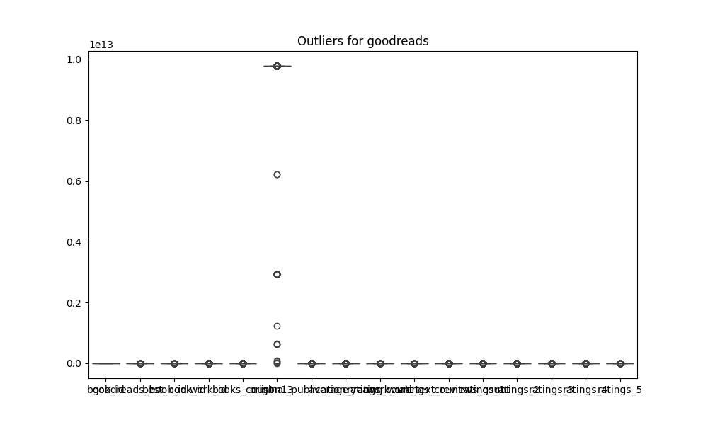

# Automated Data Analysis
## Analysis of goodreads.csv
### Summary Statistics
           book_id  goodreads_book_id  best_book_id       work_id   books_count        isbn13  original_publication_year  average_rating  ratings_count  work_ratings_count  work_text_reviews_count      ratings_1      ratings_2      ratings_3     ratings_4     ratings_5
count  10000.00000       1.000000e+04  1.000000e+04  1.000000e+04  10000.000000  9.415000e+03                9979.000000    10000.000000   1.000000e+04        1.000000e+04             10000.000000   10000.000000   10000.000000   10000.000000  1.000000e+04  1.000000e+04
mean    5000.50000       5.264697e+06  5.471214e+06  8.646183e+06     75.712700  9.755044e+12                1981.987674        4.002191   5.400124e+04        5.968732e+04              2919.955300    1345.040600    3110.885000   11475.893800  1.996570e+04  2.378981e+04
std     2886.89568       7.575462e+06  7.827330e+06  1.175106e+07    170.470728  4.428619e+11                 152.576665        0.254427   1.573700e+05        1.678038e+05              6124.378132    6635.626263    9717.123578   28546.449183  5.144736e+04  7.976889e+04
min        1.00000       1.000000e+00  1.000000e+00  8.700000e+01      1.000000  1.951703e+08               -1750.000000        2.470000   2.716000e+03        5.510000e+03                 3.000000      11.000000      30.000000     323.000000  7.500000e+02  7.540000e+02
25%     2500.75000       4.627575e+04  4.791175e+04  1.008841e+06     23.000000  9.780316e+12                1990.000000        3.850000   1.356875e+04        1.543875e+04               694.000000     196.000000     656.000000    3112.000000  5.405750e+03  5.334000e+03
50%     5000.50000       3.949655e+05  4.251235e+05  2.719524e+06     40.000000  9.780452e+12                2004.000000        4.020000   2.115550e+04        2.383250e+04              1402.000000     391.000000    1163.000000    4894.000000  8.269500e+03  8.836000e+03
75%     7500.25000       9.382225e+06  9.636112e+06  1.451775e+07     67.000000  9.780831e+12                2011.000000        4.180000   4.105350e+04        4.591500e+04              2744.250000     885.000000    2353.250000    9287.000000  1.602350e+04  1.730450e+04
max    10000.00000       3.328864e+07  3.553423e+07  5.639960e+07   3455.000000  9.790008e+12                2017.000000        4.820000   4.780653e+06        4.942365e+06            155254.000000  456191.000000  436802.000000  793319.000000  1.481305e+06  3.011543e+06
### Missing Values
book_id                         0
goodreads_book_id               0
best_book_id                    0
work_id                         0
books_count                     0
isbn                          700
isbn13                        585
authors                         0
original_publication_year      21
original_title                585
title                           0
language_code                1084
average_rating                  0
ratings_count                   0
work_ratings_count              0
work_text_reviews_count         0
ratings_1                       0
ratings_2                       0
ratings_3                       0
ratings_4                       0
ratings_5                       0
image_url                       0
small_image_url                 0
### Correlation Matrix

### Outliers

### Trend Analysis

### Analysis Story
### Summary of the Goodreads Dataset

1. **Dataset Description:**
   This dataset contains ratings, reviews, and publication details for 10,000 books on Goodreads, a popular platform for readers to review and rate books. Each entry includes various metrics such as average ratings, number of ratings, count of text reviews, and publication year to evaluate the performance and reception of the books.

2. **Analysis and Key Insights:**
   - The average book rating across the dataset is approximately 4.00, indicating a generally positive reception among readers.
   - There is a significant number of ratings and reviews, with average ratings count exceeding 54,000 and work ratings count above 59,000, which suggests active reader engagement with the listed books.
   - Notably, there is a strong correlation between counts of ratings (ratings_count and work_ratings_count) and ratings (specifically, ratings_1 to ratings_5). For example, ratings_5 shows a high correlation (0.964) with the work_ratings_count, indicating that books receiving high counts of ratings are likely to also receive higher scores.
   - There appear to be outliers in various columns (e.g., ratings_count and work_text_reviews_count), suggesting some books received unusually high attention or ratings.

3. **Surprising or Important Findings:**
   - The dataset shows that certain years of publication lead to higher ratings, which might suggest trends in reader preferences or publishing practices.
   - There are missing values in several columns, particularly in 'isbn13' and 'original_title,' which can hinder a comprehensive analysis of the dataset.
   - Interestingly, the number of books published doesn�t linearly relate to the ratings received, indicating that even a small number of reviews can influence overall ratings significantly.

4. **Suggestions for Real-World Actions or Implications:**
   - **Identify Popular Genres:** Focus marketing efforts on genres with high average ratings but lower books count, as these could represent untapped opportunities with dedicated audiences.
   - **Address Outlier Books:** Investigate books with outlier ratings for strategies that contributed to their success, which could be applicable to boosting lesser-rated titles.
   - **Engagement with Readers:** Encourage more reader engagement through readers' incentives that could lead to increased ratings and reviews while maintaining quality feedback.
   - **Fill Gaps in Data:** Address the missing values in 'isbn13,' 'original_title,' and 'language_code' to enrich dataset quality for further analyses and ensure more robust models or recommendations based on the findings.

In conclusion, this dataset offers a wealth of information on the trends, preferences, and engagement within the Goodreads community, which can be leveraged by publishers and authors to enhance their strategies and book visibility.
